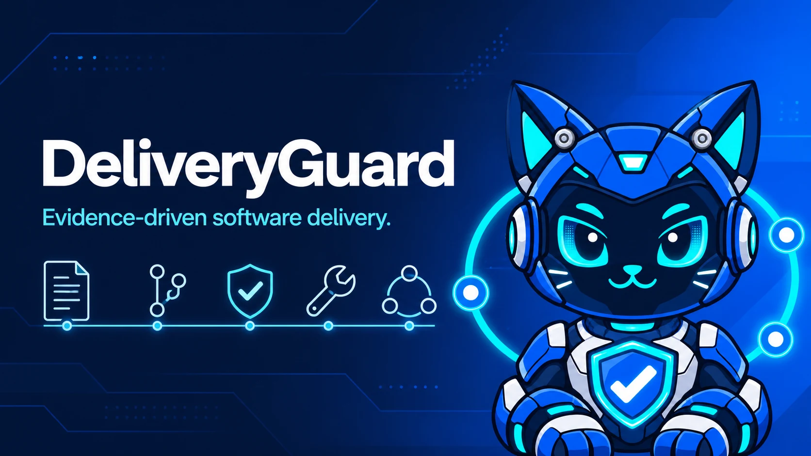

<p align="center">
  
</p>

# DeliveryGuard

[English](README.md)

**让软件交付以证据为准。** DeliveryGuard 把需求、源码提交、验收证据、修复检查和生产发布锚点变成可以由人和 Coding Agent 共同验证的明确门禁。

> Developer Preview：`v0.x` 阶段的 Schema 与 CLI 可能根据真实使用反馈调整。

## 为什么需要 DeliveryGuard？

软件交付经常把不同结论混成一句模糊的“完成”。DeliveryGuard 明确区分：

```text
planned -> specified -> implemented -> verified -> released
```

- 有提案不等于已实现。
- 测试通过不等于需求证据覆盖完整。
- 验收通过不等于已经生产发布。
- 预览地址不等于生产部署锚点。
- 修复必须有可复现的 red、green 和 regression 证据。

DeliveryGuard 只记录事实并推导当前能够成立的最高阶段。它不会执行部署、调用业务服务、发送消息或运行 Agent 平台。

## 快速开始

```sh
npx deliveryguard init --codex
npx deliveryguard check
npx deliveryguard status
```

初始化不会覆盖已有文件。生成内容包括 `deliveryguard.config.json`、`.deliveryguard/`、`openspec/changes/`，以及覆盖完整交付流程的 17 个供应商无关 Codex Skills。

## 命令

| 命令 | 用途 |
| --- | --- |
| `deliveryguard init [--codex]` | 安全创建初始目录与配置 |
| `deliveryguard check [--json]` | 校验全部交付门禁 |
| `deliveryguard status [--json]` | 查看推导后的生命周期阶段 |
| `deliveryguard version validate [path]` | 校验版本记录 |
| `deliveryguard acceptance validate <path> --version <path>` | 校验证据覆盖 |
| `deliveryguard repair validate [path]` | 校验 Repair Case |
| `deliveryguard repair run <path> --phase <phase>` | 不经过 shell 执行声明的 argv 检查 |

在命令前使用 `-C <目录>` 可以检查其他项目。

## 完整示例

[`examples/synthetic-shop`](examples/synthetic-shop) 是完全虚构的双仓库项目，展示 OpenSpec、源码、验收、Repair Case 和生产发布证据的完整闭环。

```sh
deliveryguard -C examples/synthetic-shop check
```

继续阅读[架构说明](docs/architecture.zh-CN.md)、[配置参考](docs/configuration.zh-CN.md)、[Codex Skill 目录](docs/codex-skills.zh-CN.md)和[品牌指南](docs/brand.zh-CN.md)。

## 参与贡献

欢迎提交 Issue 和 Pull Request。请阅读 [CONTRIBUTING.zh-CN.md](CONTRIBUTING.zh-CN.md)、[SECURITY.md](SECURITY.md)和 [CODE_OF_CONDUCT.md](CODE_OF_CONDUCT.md)。Clean-room 来源说明见 [PROVENANCE.md](PROVENANCE.md)。

## 许可证

[MIT](LICENSE) © 2026 wzf1997。
